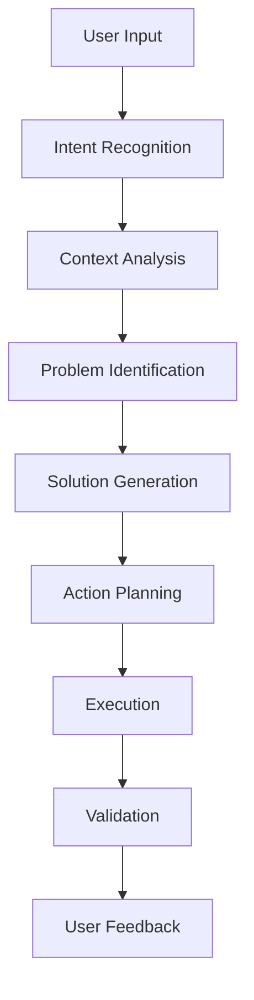

# Agentic AI Ordering System - Complete Requirements & Architecture Document

## Table of Contents
1. [Project Overview & Objectives](#project-overview--objectives)
2. [System Architecture](#system-architecture)
3. [Database Schema Design](#database-schema-design)
4. [API Specifications](#api-specifications)
5. [MCP Server Architecture](#mcp-server-architecture)
6. [AI Agent Design](#ai-agent-design)
7. [Frontend Requirements](#frontend-requirements)
8. [Implementation Phases](#implementation-phases)
9. [Environment Setup](#environment-setup)
10. [Testing Strategy](#testing-strategy)
11. [Success Metrics](#success-metrics)

---

## Project Overview & Objectives

### Project Name
**Agentic AI Ordering System with Multi-Level Approval Workflow**

### Purpose
Build a POC system demonstrating agentic AI capabilities for enterprise order management with intelligent automation and cross-system integration.

### Core Objectives
- ✅ **Intelligent AI Agent**: Diagnose order issues and take corrective actions automatically
- ✅ **Multi-Level Approval Workflows**: Dynamic routing with conditional approval levels
- ✅ **MCP Integration**: Model Context Protocol server for external system communication
- ✅ **Enterprise Architecture**: Scalable, production-ready using modern tech stack
- ✅ **Natural Language Interface**: Complex business process automation through conversation

### Key Business Scenarios
1. **Order Rejection Recovery**: AI agent helps users fix rejected orders and resubmit automatically
2. **Intelligent Assistance**: Natural language problem-solving for order-related issues
3. **Cross-System Integration**: Seamless data flow between ProductDesigner and Order Management systems
4. **Automated Workflows**: Reduce manual intervention in approval processes

---

## System Architecture

### Technology Stack

#### Backend Technology
```
🔧 .NET 8.0 Web API          - Primary backend framework
🔧 C# 12                     - Programming language
🔧 MongoDB Driver 2.25.0     - Database connectivity
🔧 ASP.NET Core              - Web framework
🔧 Swagger/OpenAPI           - API documentation
```

#### Frontend Technology
```
🎨 Angular 17+               - Frontend framework
🎨 TypeScript                - Programming language
🎨 Angular Material          - UI component library
🎨 RxJS                      - Reactive programming
```

#### Database
```
💾 MongoDB                   - Primary database (two separate databases)
💾 MongoDB Atlas             - Cloud hosting (recommended)
💾 MongoDB Compass           - Database administration tool
```

#### AI & Integration
```
🤖 Perplexity API           - LLM for AI agent intelligence
🤖 MCP (Model Context Protocol) - System integration protocol
🤖 Custom MCP Server        - Tool orchestration and system communication
```

#### Development Tools
```
🛠️ VS Code                  - Primary IDE with AI Toolkit extension
🛠️ Docker                   - Containerization for development
🛠️ Postman                  - API testing
🛠️ Git                      - Version control
```

### System Architecture Diagram
```
┌─────────────────┐    ┌─────────────────┐    ┌─────────────────┐
│   Angular UI    │────│   .NET API      │────│   MongoDB       │
│                 │    │                 │    │   Databases     │
│ • Order Forms   │    │ • Controllers   │    │                 │
│ • AI Chat       │    │ • Services      │    │ • ProductDB     │
│ • Dashboard     │    │ • MCP Server    │    │ • CMP_DB        │
└─────────────────┘    └─────────────────┘    └─────────────────┘
         │                       │                       │
         │              ┌─────────────────┐              │
         └──────────────│  Perplexity API │──────────────┘
                        │                 │
                        │ • AI Analysis   │
                        │ • NLP           │
                        │ • Recommendations│
                        └─────────────────┘
```

---

## Database Schema Design

### Database Structure Overview
```
MongoDB Deployment:
├── ProductDesigner_DB (System 1)
│   ├── products
│   └── categories  
└── CMP_DB (Order Management Platform)
    ├── users
    ├── orders
    ├── approvalHistory
    ├── aiAgentSessions
    └── notifications
```

### ProductDesigner Database Collections

#### Products Collection Schema
```json
{
  "_id": "string",                    // ProductId as primary identifier
  "name": "string",                   // Product display name
  "description": "string",            // Product description
  "category": "string",               // software|hardware|training|services
  "isActive": "boolean",              // Active status flag
  "createdAt": "ISODate",            // Creation timestamp
  "updatedAt": "ISODate",            // Last update timestamp
  
  "approvalModel": {
    "level1": {
      "required": "boolean",          // Whether L1 approval is mandatory
      "approverType": "string",       // manager|director|md
      "timeoutHours": "number",       // Approval timeout
      "triggerConditions": {
        "minAmount": "number",        // Minimum amount requiring approval
        "maxAmount": "number",        // Maximum amount for this level
        "departments": ["string"],    // Applicable departments
        "riskFactors": ["string"]     // Risk factors triggering approval
      }
    },
    "level2": {
      "required": "boolean",
      "approverType": "string",
      "timeoutHours": "number",
      "triggerConditions": {
        "minAmount": "number",
        "departments": ["string"],
        "escalationRules": ["string"]
      }
    }
  },
  
  "questions": [
    {
      "questionId": "string",         // Unique question identifier
      "key": "string",                // Form field key for answers
      "question": "string",           // Display text for the question
      "type": "string",               // text|textarea|number|select|multiselect|date
      "required": "boolean",          // Mandatory field flag
      "validation": {
        "pattern": "string",          // Regex pattern for validation
        "min": "number",              // Minimum value/length
        "max": "number",              // Maximum value/length
        "length": {
          "min": "number",
          "max": "number"
        }
      },
      "options": [                    // For select/multiselect types
        {
          "value": "string",
          "label": "string"
        }
      ],
      "helpText": "string",           // User guidance text
      "order": "number",              // Display sequence
      "conditionalDisplay": {         // Show/hide based on other answers
        "dependsOn": "string",        // Question key dependency
        "condition": "string",        // equals|contains|greaterThan
        "value": "any"                // Trigger value
      }
    }
  ],
  
  "metadata": {
    "vendor": "string",
    "category": "string",
    "tags": ["string"],
    "businessUnit": "string"
  }
}
```

#### Categories Collection Schema
```json
{
  "_id": "string",                    // CategoryId
  "name": "string",                   // Category name
  "description": "string",            // Category description
  "parentCategoryId": "string",       // For hierarchical categories
  "isActive": "boolean",              // Active status
  "sortOrder": "number",              // Display order
  "metadata": {
    "defaultApprovalModel": "object", // Default approval settings
    "requiredFields": ["string"],     // Mandatory question types
    "businessRules": ["string"]       // Category-specific rules
  }
}
```

### CMP Database Collections

#### Users Collection Schema
```json
{
  "_id": "string",                    // UserId as primary identifier
  "employeeId": "string",             // Company employee ID
  "email": "string",                  // User email address
  "firstName": "string",              // User first name
  "lastName": "string",               // User last name
  "department": "string",             // User's department
  "role": "string",                   // employee|manager|director|md|admin
  "managerId": "string",              // Reference to manager's UserId
  "isActive": "boolean",              // Account status
  "createdAt": "ISODate",            // Account creation
  "lastLoginAt": "ISODate",          // Last login timestamp
  
  "approvalAuthority": {
    "canApprove": "boolean",          // Approval capability flag
    "maxApprovalAmount": "number",    // Maximum approval limit
    "departments": ["string"],        // Departments user can approve for
    "productCategories": ["string"],  // Product types user can approve
    "delegationRules": {
      "canDelegate": "boolean",
      "delegateToRoles": ["string"],
      "maxDelegationDays": "number"
    }
  },
  
  "preferences": {
    "notificationMethods": ["string"], // email|sms|slack|inapp
    "language": "string",              // Preferred language
    "timezone": "string",              // User timezone
    "dashboardLayout": "object"        // Custom dashboard settings
  },
  
  "contactInfo": {
    "phone": "string",
    "slackId": "string",
    "officeLocation": "string"
  }
}
```

#### Orders Collection Schema
```json
{
  "_id": "string",                    // OrderId as primary identifier
  "orderNumber": "string",            // Human-readable (REQ-2025-001)
  "userId": "string",                 // Reference to users collection
  "userName": "string",               // Denormalized user name
  "productId": "string",              // Reference to ProductDesigner_DB
  "productName": "string",            // Denormalized product name
  "status": "string",                 // draft|submitted|pending_l1|pending_l2|approved|rejected|cancelled|resubmitted
  "priority": "string",               // low|medium|high|urgent
  "createdAt": "ISODate",            // Order creation
  "updatedAt": "ISODate",            // Last modification
  "submittedAt": "ISODate",          // Submission timestamp
  
  "answers": {                        // Dynamic answers to product questions
    "questionKey1": "any",            // User's answer to question
    "questionKey2": "any",
    "calculatedFields": {
      "totalAmount": "number",        // Calculated total cost
      "riskScore": "number",          // Risk assessment (0.0-1.0)
      "businessImpact": "string",     // high|medium|low
      "urgencyScore": "number"        // Calculated urgency
    }
  },
  
  "approvalWorkflow": {
    "currentLevel": "number",         // Current approval level
    "maxLevel": "number",             // Maximum levels required
    "isComplete": "boolean",          // Workflow completion status
    "nextApproverId": "string",       // Next approver in queue
    "requiresLevel2": "boolean",      // Whether L2 approval needed
    "escalationRules": {
      "autoEscalateAfterHours": "number",
      "escalationPath": ["string"]
    }
  },
  
  "approvalHistory": [
    {
      "approvalId": "string",         // Unique approval action ID
      "level": "number",              // Approval level
      "approverId": "string",         // Approver user ID
      "approverName": "string",       // Approver display name
      "action": "string",             // approved|rejected|requested_info|delegated
      "comment": "string",            // Approver comments
      "timestamp": "ISODate",         // Action timestamp
      "notifiedAt": "ISODate",        // Notification timestamp
      "responseTime": "number",       // Time to respond (hours)
      "metadata": {
        "ipAddress": "string",
        "userAgent": "string",
        "location": "string"
      }
    }
  ],
  
  "rejectionDetails": {
    "rejectedBy": "string",           // Rejecting approver ID
    "rejectedAt": "ISODate",          // Rejection timestamp
    "overallReason": "string",        // High-level rejection reason
    "specificIssues": [
      {
        "questionKey": "string",      // Form field with issue
        "questionText": "string",     // Question display text
        "currentAnswer": "any",       // User's current answer
        "issueDescription": "string", // Specific problem description
        "suggestedAction": "string",  // Recommended remediation
        "severity": "string",         // high|medium|low
        "category": "string"          // validation|policy|business
      }
    ],
    "aiAnalysis": {
      "confidence": "number",         // AI confidence in analysis
      "suggestions": ["string"],      // AI-generated suggestions
      "similarCases": ["string"],     // Similar resolved cases
      "estimatedFixTime": "number"    // Minutes to fix
    }
  },
  
  "resubmissionHistory": [
    {
      "resubmissionId": "string",     // Unique resubmission ID
      "resubmittedAt": "ISODate",     // Resubmission timestamp
      "changedAnswers": {             // Modified question answers
        "questionKey": {
          "oldValue": "any",
          "newValue": "any",
          "changeReason": "string"
        }
      },
      "reason": "string",             // Reason for resubmission
      "triggeredBy": "string",        // user|agent
      "aiAssisted": "boolean",        // Whether AI helped with changes
      "validationResults": {
        "passed": "boolean",
        "issues": ["string"]
      }
    }
  ],
  
  "attachments": [
    {
      "attachmentId": "string",
      "fileName": "string",
      "fileSize": "number",
      "mimeType": "string",
      "uploadedAt": "ISODate",
      "uploadedBy": "string"
    }
  ]
}
```

#### AI Agent Sessions Collection Schema
```json
{
  "_id": "string",                    // SessionId as primary identifier
  "userId": "string",                 // Reference to user
  "orderId": "string",                // Optional reference to specific order
  "status": "string",                 // active|completed|abandoned|error
  "startedAt": "ISODate",            // Session start
  "endedAt": "ISODate",              // Session end
  
  "context": {
    "problem": "string",              // User's initial problem statement
    "intent": "string",               // check_status|update_order|get_help|resubmit
    "currentStep": "string",          // Current workflow step
    "collectedData": {                // Dynamic data collected during conversation
      "userPreferences": "object",
      "sessionData": "object",
      "workflowState": "object"
    }
  },
  
  "conversation": [
    {
      "messageId": "string",          // Unique message identifier
      "sender": "string",             // user|agent
      "message": "string",            // Message content
      "timestamp": "ISODate",         // Message timestamp
      "messageType": "string",        // text|action|system|error|suggestion
      "metadata": {
        "toolsCalled": [              // MCP tools used for this message
          {
            "toolName": "string",
            "parameters": "object",
            "result": "object",
            "executionTime": "number"
          }
        ],
        "confidence": "number",       // AI confidence score (0.0-1.0)
        "processingTime": "number",   // Response generation time (ms)
        "tokens": {
          "input": "number",
          "output": "number",
          "cost": "number"
        }
      }
    }
  ],
  
  "actions": [
    {
      "actionId": "string",           // Unique action identifier
      "actionType": "string",         // update_order|send_notification|change_status
      "parameters": "object",         // Action-specific parameters
      "status": "string",             // pending|completed|failed
      "timestamp": "ISODate",         // Action timestamp
      "result": {
        "success": "boolean",
        "message": "string",
        "data": "object",
        "errorDetails": "object"
      }
    }
  ],
  
  "analytics": {
    "sessionDuration": "number",      // Total session time (minutes)
    "messageCount": "number",         // Total messages exchanged
    "problemResolved": "boolean",     // Whether issue was resolved
    "userSatisfaction": "number",     // User rating (1-5)
    "aiEffectiveness": "number",      // AI performance score
    "costMetrics": {
      "totalTokens": "number",
      "totalCost": "number",
      "efficiency": "number"
    }
  }
}
```

#### Notifications Collection Schema
```json
{
  "_id": "string",                    // NotificationId
  "userId": "string",                 // Target user
  "orderId": "string",                // Related order
  "type": "string",                   // approval_request|status_change|reminder|alert
  "priority": "string",               // low|medium|high|urgent
  "title": "string",                  // Notification title
  "message": "string",                // Notification content
  "status": "string",                 // pending|sent|delivered|read|failed
  "channels": ["string"],             // email|sms|slack|inapp
  "createdAt": "ISODate",            // Creation timestamp
  "sentAt": "ISODate",               // Send timestamp
  "readAt": "ISODate",               // Read timestamp
  
  "metadata": {
    "templateId": "string",           // Template used
    "variables": "object",            // Template variables
    "actionButtons": [
      {
        "label": "string",
        "action": "string",
        "url": "string"
      }
    ]
  },
  
  "delivery": {
    "attempts": "number",             // Delivery attempts
    "lastAttempt": "ISODate",         // Last attempt timestamp
    "errorMessage": "string",         // Last error message
    "deliveryConfirmation": "boolean" // Whether delivery was confirmed
  }
}
```

---

## API Specifications

### Core API Endpoints

#### Order Management APIs
```
GET    /api/orders                   - Get user orders with filtering
GET    /api/orders/{id}              - Get specific order details
POST   /api/orders                   - Create new order
PUT    /api/orders/{id}              - Update order
DELETE /api/orders/{id}              - Cancel order
POST   /api/orders/{id}/submit       - Submit order for approval
POST   /api/orders/{id}/resubmit     - Resubmit after changes
```

#### Product APIs
```
GET    /api/products                 - List available products
GET    /api/products/{id}            - Get product details
GET    /api/products/{id}/questions  - Get product questions
POST   /api/products/{id}/validate   - Validate answers
```

#### User & Approval APIs
```
GET    /api/users/profile            - Get user profile
GET    /api/users/pending-approvals  - Get pending approvals
POST   /api/approvals/{id}/approve   - Approve order
POST   /api/approvals/{id}/reject    - Reject order
POST   /api/approvals/{id}/request-info - Request more information
```

#### AI Agent APIs
```
POST   /api/ai/sessions              - Start AI session
POST   /api/ai/sessions/{id}/message - Send message to AI
GET    /api/ai/sessions/{id}         - Get session history
POST   /api/ai/analyze-rejection     - Analyze rejection reasons
POST   /api/ai/suggest-fixes         - Get fix suggestions
```

### API Response Standards
```json
{
  "success": "boolean",
  "data": "object|array",
  "message": "string",
  "errors": [
    {
      "code": "string",
      "message": "string",
      "field": "string"
    }
  ],
  "metadata": {
    "timestamp": "ISODate",
    "requestId": "string",
    "pagination": {
      "page": "number",
      "limit": "number",
      "total": "number",
      "totalPages": "number"
    }
  }
}
```

---

## MCP Server Architecture

### Core MCP Tools Categories

#### 1. Order Management Tools
```typescript
// Get user orders with advanced filtering
get_user_orders: {
  parameters: {
    userId: string,
    status?: string[],
    dateRange?: { start: Date, end: Date },
    productCategory?: string,
    limit?: number,
    offset?: number
  },
  returns: {
    orders: Order[],
    totalCount: number,
    summary: OrderSummary
  }
}

// Get complete order information with context
get_order_details: {
  parameters: {
    orderId: string,
    includeHistory?: boolean,
    includeApprovals?: boolean
  },
  returns: {
    order: Order,
    approvalWorkflow: ApprovalWorkflow,
    aiRecommendations?: AIRecommendation[]
  }
}

// Modify order responses and resubmit
update_order_answers: {
  parameters: {
    orderId: string,
    answers: { [key: string]: any },
    reason: string,
    validateOnly?: boolean
  },
  returns: {
    success: boolean,
    validationResults: ValidationResult[],
    resubmissionId?: string
  }
}

// Change order workflow status
update_order_status: {
  parameters: {
    orderId: string,
    newStatus: OrderStatus,
    comment?: string,
    notifyStakeholders?: boolean
  },
  returns: {
    success: boolean,
    workflowState: WorkflowState,
    notificationsSent: string[]
  }
}
```

#### 2. Product Information Tools
```typescript
// Fetch product definitions and questions
get_product_info: {
  parameters: {
    productId: string,
    includeQuestions?: boolean,
    includeApprovalModel?: boolean
  },
  returns: {
    product: Product,
    questions: Question[],
    approvalModel: ApprovalModel
  }
}

// List available products with filtering
list_products: {
  parameters: {
    category?: string,
    searchTerm?: string,
    isActive?: boolean,
    limit?: number
  },
  returns: {
    products: ProductSummary[],
    categories: Category[]
  }
}

// Validate user answers against product rules
validate_product_answers: {
  parameters: {
    productId: string,
    answers: { [key: string]: any },
    userId: string
  },
  returns: {
    isValid: boolean,
    errors: ValidationError[],
    warnings: ValidationWarning[],
    suggestions: string[]
  }
}
```

#### 3. AI Analysis Tools
```typescript
// AI-powered rejection analysis
analyze_rejection: {
  parameters: {
    orderId: string,
    rejectionDetails: RejectionDetails,
    includeContext?: boolean
  },
  returns: {
    analysis: AIAnalysis,
    recommendations: Recommendation[],
    confidence: number,
    similarCases: SimilarCase[]
  }
}

// Generate intelligent suggestions
generate_suggestions: {
  parameters: {
    orderId: string,
    problemContext: string,
    userIntent: string
  },
  returns: {
    suggestions: Suggestion[],
    actionPlan: ActionPlan,
    estimatedTime: number
  }
}

// Validate proposed changes
validate_proposed_changes: {
  parameters: {
    orderId: string,
    proposedChanges: { [key: string]: any },
    validationLevel: 'basic' | 'comprehensive'
  },
  returns: {
    validationResult: ValidationResult,
    impactAssessment: ImpactAssessment,
    approvalLikelihood: number
  }
}
```

#### 4. Notification & Communication Tools
```typescript
// Send notifications to stakeholders
send_notification: {
  parameters: {
    recipients: string[],
    type: NotificationType,
    orderId?: string,
    customMessage?: string,
    urgency: 'low' | 'medium' | 'high'
  },
  returns: {
    notificationIds: string[],
    deliveryStatus: DeliveryStatus[],
    estimatedDeliveryTime: number
  }
}

// Create system alerts
create_alert: {
  parameters: {
    alertType: AlertType,
    severity: 'info' | 'warning' | 'error',
    message: string,
    metadata?: object
  },
  returns: {
    alertId: string,
    escalationRules: EscalationRule[]
  }
}
```

#### 5. Session Management Tools
```typescript
// Track AI agent interactions
create_agent_session: {
  parameters: {
    userId: string,
    orderId?: string,
    initialContext: SessionContext
  },
  returns: {
    sessionId: string,
    expiresAt: Date,
    capabilities: string[]
  }
}

// Update conversation state
update_agent_session: {
  parameters: {
    sessionId: string,
    message: Message,
    actions?: Action[],
    contextUpdate?: Partial<SessionContext>
  },
  returns: {
    success: boolean,
    sessionState: SessionState,
    nextSteps: string[]
  }
}
```

### MCP Tool Design Patterns

#### Standardized Interface
```typescript
interface IMCPTool {
  name: string;
  description: string;
  parameters: ParameterSchema;
  execute(params: any): Promise<ToolResult>;
  validate(params: any): ValidationResult;
}
```

#### Parameter Validation Framework
```typescript
interface ParameterSchema {
  [key: string]: {
    type: 'string' | 'number' | 'boolean' | 'object' | 'array';
    required: boolean;
    validation?: {
      pattern?: string;
      min?: number;
      max?: number;
      enum?: any[];
    };
    description: string;
  }
}
```

#### Response Structure
```typescript
interface ToolResult {
  success: boolean;
  data?: any;
  error?: {
    code: string;
    message: string;
    details?: any;
  };
  metadata: {
    executionTime: number;
    toolVersion: string;
    requestId: string;
  };
}
```

---

## AI Agent Design

### Problem Diagnosis Flow


### Conversation Context Management

#### Session Tracking Schema
```typescript
interface SessionContext {
  userId: string;
  currentIntent: 'check_status' | 'update_order' | 'get_help' | 'resubmit';
  conversationState: 'greeting' | 'problem_identification' | 'solution_planning' | 'execution' | 'completion';
  workflowMemory: {
    [stepId: string]: {
      completed: boolean;
      data: any;
      timestamp: Date;
    }
  };
  userPreferences: {
    communicationStyle: 'formal' | 'casual';
    detailLevel: 'brief' | 'detailed';
    autoExecute: boolean;
  };
}
```

#### Intent Recognition Patterns
```typescript
interface IntentPattern {
  intent: string;
  patterns: string[];
  confidence: number;
  requiredEntities: string[];
  followUpQuestions: string[];
}

const INTENT_PATTERNS: IntentPattern[] = [
  {
    intent: 'check_order_status',
    patterns: [
      'what is the status of my order',
      'where is my request',
      'has my order been approved'
    ],
    confidence: 0.9,
    requiredEntities: ['order_id'],
    followUpQuestions: ['Which specific order are you asking about?']
  },
  {
    intent: 'fix_rejected_order',
    patterns: [
      'my order was rejected',
      'how do I fix my request',
      'what went wrong with my order'
    ],
    confidence: 0.95,
    requiredEntities: ['order_id'],
    followUpQuestions: ['Let me analyze the rejection details for you.']
  }
];
```

### Remediation Flow Design

#### Step-by-Step Process
```typescript
interface RemediationStep {
  stepId: string;
  name: string;
  description: string;
  requiredInputs: string[];
  mcpTools: string[];
  validationRules: ValidationRule[];
  nextSteps: string[];
}

const REMEDIATION_STEPS: RemediationStep[] = [
  {
    stepId: 'analyze_rejection',
    name: 'Analyze Rejection Reasons',
    description: 'Use AI to understand why the order was rejected',
    requiredInputs: ['orderId'],
    mcpTools: ['get_order_details', 'analyze_rejection'],
    validationRules: [],
    nextSteps: ['generate_solutions']
  },
  {
    stepId: 'generate_solutions',
    name: 'Generate Solution Options',
    description: 'Create specific, actionable recommendations',
    requiredInputs: ['rejectionAnalysis'],
    mcpTools: ['generate_suggestions', 'validate_proposed_changes'],
    validationRules: [],
    nextSteps: ['collect_user_input']
  },
  {
    stepId: 'collect_user_input',
    name: 'Gather Required Information',
    description: 'Interactive collection of missing or corrected data',
    requiredInputs: ['solutionPlan'],
    mcpTools: ['get_product_info'],
    validationRules: ['validateAnswerFormat', 'checkBusinessRules'],
    nextSteps: ['validate_changes']
  }
];
```

---

## Frontend Requirements

### Component Architecture

#### Core Components Structure
```
src/app/
├── components/
│   ├── orders/
│   │   ├── order-list/
│   │   ├── order-form/
│   │   ├── order-details/
│   │   └── approval-interface/
│   ├── ai-chat/
│   │   ├── chat-interface/
│   │   ├── message-bubble/
│   │   └── action-suggestions/
│   ├── dashboard/
│   │   ├── user-dashboard/
│   │   ├── manager-dashboard/
│   │   └── analytics-panel/
│   └── shared/
│       ├── dynamic-form/
│       ├── notification-panel/
│       └── status-indicators/
├── services/
│   ├── order.service.ts
│   ├── ai-agent.service.ts
│   ├── notification.service.ts
│   └── auth.service.ts
├── models/
│   ├── order.interface.ts
│   ├── product.interface.ts
│   ├── user.interface.ts
│   └── ai-session.interface.ts
└── shared/
    ├── guards/
    ├── interceptors/
    └── validators/
```

#### Dynamic Form Generation Requirements
```typescript
interface DynamicFormConfig {
  productId: string;
  questions: FormQuestion[];
  validationRules: ValidationRule[];
  conditionalLogic: ConditionalRule[];
  savePolicy: 'auto' | 'manual' | 'on_change';
}

interface FormQuestion {
  key: string;
  type: 'text' | 'textarea' | 'number' | 'select' | 'multiselect' | 'date' | 'file';
  label: string;
  placeholder?: string;
  required: boolean;
  validation: ValidationConfig;
  options?: SelectOption[];
  helpText?: string;
  order: number;
  groupId?: string;
  conditionalDisplay?: ConditionalDisplay;
}
```

#### AI Chat Interface Requirements
```typescript
interface ChatMessage {
  id: string;
  sender: 'user' | 'agent';
  message: string;
  timestamp: Date;
  type: 'text' | 'action' | 'suggestion' | 'error';
  actions?: ChatAction[];
  metadata?: {
    confidence?: number;
    toolsUsed?: string[];
    processingTime?: number;
  };
}

interface ChatAction {
  actionId: string;
  label: string;
  type: 'button' | 'link' | 'form';
  data?: any;
  confirmationRequired?: boolean;
}
```

### User Experience Requirements

#### Responsive Design Specifications
- **Mobile First**: Optimized for mobile devices (320px+)
- **Tablet Support**: Enhanced experience for tablets (768px+)
- **Desktop Features**: Full feature set for desktop (1024px+)
- **Accessibility**: WCAG 2.1 AA compliance

#### Performance Requirements
- **Initial Load**: < 3 seconds on 3G
- **Route Transitions**: < 200ms
- **Form Interactions**: < 100ms response time
- **Chat Messages**: < 500ms AI response display

#### Theme & Styling
```scss
// Material Design Variables
$primary-color: #1976d2;
$accent-color: #ff4081;
$warn-color: #f44336;
$success-color: #4caf50;

// Custom Theme Variables
$order-status-colors: (
  'draft': #9e9e9e,
  'submitted': #2196f3,
  'pending': #ff9800,
  'approved': #4caf50,
  'rejected': #f44336,
  'cancelled': #795548
);

$priority-colors: (
  'low': #4caf50,
  'medium': #ff9800,
  'high': #ff5722,
  'urgent': #f44336
);
```

---

## Implementation Phases

### Phase 1: Backend API Foundation (Weeks 1-2)

#### Week 1 Objectives
- ✅ Project setup and solution structure
- ✅ MongoDB connection and database services
- ✅ Basic entity models and DTOs
- ✅ Core API controllers (Orders, Products, Users)
- ✅ Dependency injection configuration

#### Week 2 Objectives
- ✅ CRUD operations implementation
- ✅ Validation framework setup
- ✅ Error handling middleware
- ✅ Swagger documentation
- ✅ Unit tests for services
- ✅ Logging infrastructure

#### Key Deliverables
```
✅ Database service layer with async operations
✅ API controllers for Orders, Products, Users
✅ Swagger API documentation
✅ Basic validation and error handling
✅ Unit tests for core business logic
✅ Environment configuration setup
```

### Phase 2: MCP Server Implementation (Weeks 3-4)

#### Week 3 Objectives
- ✅ MCP server infrastructure setup
- ✅ Tool interface design and implementation
- ✅ Order management tools development
- ✅ Product information tools
- ✅ Basic validation framework

#### Week 4 Objectives
- ✅ AI analysis tools integration
- ✅ Notification system tools
- ✅ Session management tools
- ✅ Comprehensive error handling
- ✅ Performance optimization

#### Key Deliverables
```
✅ Complete MCP tool suite (15+ tools)
✅ Tool orchestration framework
✅ Standardized parameter validation
✅ Comprehensive logging and monitoring
✅ Integration tests for all tools
```

### Phase 3: AI Integration (Weeks 5-6)

#### Week 5 Objectives
- ✅ Perplexity API integration
- ✅ Intent recognition system
- ✅ Context management framework
- ✅ Basic conversation flows
- ✅ Problem diagnosis algorithms

#### Week 6 Objectives
- ✅ Remediation workflow engine
- ✅ Advanced conversation handling
- ✅ AI-assisted validation
- ✅ Performance optimization
- ✅ Cost management features

#### Key Deliverables
```
✅ Perplexity API service layer
✅ Intent recognition with 90%+ accuracy
✅ Context-aware conversation management
✅ Automated remediation workflows
✅ AI cost tracking and optimization
```

### Phase 4: Frontend Development (Weeks 7-8)

#### Week 7 Objectives
- ✅ Angular application setup
- ✅ Material Design implementation
- ✅ Core component development
- ✅ Dynamic form generation
- ✅ Basic order management UI

#### Week 8 Objectives
- ✅ AI chat interface development
- ✅ Dashboard and analytics
- ✅ Approval interface for managers
- ✅ Responsive design implementation
- ✅ End-to-end testing

#### Key Deliverables
```
✅ Complete Angular application
✅ Dynamic form generation system
✅ AI chat interface with rich interactions
✅ Responsive design (mobile-first)
✅ Manager approval interface
✅ Real-time notifications
```

---

## Environment Setup

### Development Environment Requirements

#### Visual Studio Code Extensions
```json
{
  "recommendations": [
    "ms-dotnettools.csharp",
    "ms-dotnettools.csdevkit",
    "angular.ng-template",
    "mongodb.mongodb-vscode",
    "humao.rest-client",
    "github.copilot",
    "esbenp.prettier-vscode",
    "bradlc.vscode-tailwindcss"
  ]
}
```

#### System Requirements
```bash
# Required Software
.NET 8 SDK                    # Backend development
Node.js 18+ and npm          # Frontend development
MongoDB Community Edition    # Local database
Angular CLI (latest)         # Frontend tooling
Git                         # Version control
Docker Desktop              # Containerization

# Optional Tools
MongoDB Compass             # Database GUI
Postman                    # API testing
Azure Data Studio          # Database management
```

#### Environment Variables Setup
```bash
# .env.development
ASPNETCORE_ENVIRONMENT=Development
ASPNETCORE_URLS=https://localhost:7001;http://localhost:5001

# Database Connections
MONGODB_PRODUCTDESIGNER_CONNECTION=mongodb://localhost:27017/ProductDesigner_DB
MONGODB_CMP_CONNECTION=mongodb://localhost:27017/CMP_DB

# AI Integration
PERPLEXITY_API_KEY=your_perplexity_api_key_here
PERPLEXITY_BASE_URL=https://api.perplexity.ai

# Security
JWT_SECRET=your_jwt_secret_here
JWT_EXPIRY_HOURS=24

# Logging
LOG_LEVEL=Information
LOG_TO_FILE=true
LOG_DIRECTORY=./logs

# CORS Settings
ALLOWED_ORIGINS=http://localhost:4200,https://localhost:4200

# Feature Flags
ENABLE_AI_FEATURES=true
ENABLE_MOCK_DATA=true
ENABLE_DETAILED_LOGGING=true
```

### Database Setup Requirements

#### MongoDB Configuration
```javascript
// Database Indexes
db.orders.createIndex({ "userId": 1, "status": 1 })
db.orders.createIndex({ "orderNumber": 1 }, { unique: true })
db.orders.createIndex({ "createdAt": -1 })
db.orders.createIndex({ "approvalWorkflow.nextApproverId": 1 })

db.products.createIndex({ "category": 1, "isActive": 1 })
db.products.createIndex({ "name": "text", "description": "text" })

db.users.createIndex({ "email": 1 }, { unique: true })
db.users.createIndex({ "employeeId": 1 }, { unique: true })
db.users.createIndex({ "managerId": 1 })

db.aiAgentSessions.createIndex({ "userId": 1, "status": 1 })
db.aiAgentSessions.createIndex({ "createdAt": 1 }, { expireAfterSeconds: 2592000 }) // 30 days
```

#### Data Seeding Scripts
```json
// Sample Data Structure
{
  "products": "50+ sample products across categories",
  "users": "20+ users with different roles and authorities",
  "orders": "100+ orders in various states",
  "categories": "10+ product categories",
  "approvalHistory": "Historical approval data"
}
```

### Security Configuration

#### API Security Setup
```csharp
// Security Middleware Configuration
services.AddAuthentication(JwtBearerDefaults.AuthenticationScheme)
    .AddJwtBearer(options => {
        // JWT configuration
    });

services.AddAuthorization(options => {
    options.AddPolicy("RequireManagerRole", policy => 
        policy.RequireRole("Manager", "Director", "MD"));
    options.AddPolicy("RequireApprovalAuthority", policy =>
        policy.RequireClaim("CanApprove", "true"));
});

// CORS Configuration
services.AddCors(options => {
    options.AddPolicy("DevelopmentPolicy", policy => {
        policy.WithOrigins("http://localhost:4200", "https://localhost:4200")
              .AllowAnyMethod()
              .AllowAnyHeader()
              .AllowCredentials();
    });
});
```

#### Rate Limiting Configuration
```csharp
// Rate limiting for API endpoints
services.AddRateLimiter(options => {
    options.AddFixedWindowLimiter("ApiPolicy", config => {
        config.Window = TimeSpan.FromMinutes(1);
        config.PermitLimit = 100;
        config.QueueLimit = 10;
    });
    
    options.AddFixedWindowLimiter("AIPolicy", config => {
        config.Window = TimeSpan.FromMinutes(1);
        config.PermitLimit = 20; // Limit AI calls due to cost
        config.QueueLimit = 5;
    });
});
```

---

## Testing Strategy

### Unit Testing Framework

#### Backend Testing (C#)
```csharp
// Test Categories
[TestFixture]
public class OrderServiceTests
{
    [Test]
    public async Task CreateOrder_ValidData_ReturnsSuccess() { }
    
    [Test]
    public async Task SubmitOrder_TriggersApprovalWorkflow() { }
    
    [Test]
    public async Task RejectOrder_UpdatesStatusAndNotifications() { }
}

// Testing Tools
- xUnit / NUnit for unit testing
- Moq for mocking dependencies
- FluentAssertions for readable assertions
- AutoFixture for test data generation
- TestContainers for integration testing
```

#### Frontend Testing (Angular)
```typescript
// Component Testing
describe('OrderFormComponent', () => {
  let component: OrderFormComponent;
  let fixture: ComponentFixture<OrderFormComponent>;
  
  beforeEach(() => {
    TestBed.configureTestingModule({
      declarations: [OrderFormComponent],
      imports: [ReactiveFormsModule, MaterialModule],
      providers: [OrderService, AIAgentService]
    });
  });
  
  it('should validate required fields', () => {
    // Test implementation
  });
  
  it('should submit form with valid data', () => {
    // Test implementation
  });
});

// Testing Tools
- Jasmine/Jest for unit testing
- Angular Testing Utilities
- Cypress for E2E testing
- Spectator for simplified testing
```

### Integration Testing Strategy

#### API Integration Tests
```csharp
[TestFixture]
public class OrderApiIntegrationTests
{
    private WebApplicationFactory<Program> _factory;
    private HttpClient _client;
    
    [SetUp]
    public void Setup()
    {
        _factory = new WebApplicationFactory<Program>();
        _client = _factory.CreateClient();
    }
    
    [Test]
    public async Task POST_CreateOrder_ReturnsCreatedOrder() { }
    
    [Test]
    public async Task GET_Orders_ReturnsFilteredResults() { }
}
```

#### MCP Tool Testing
```csharp
[TestFixture]
public class MCPToolIntegrationTests
{
    [Test]
    public async Task GetUserOrders_ValidUserId_ReturnsOrders() { }
    
    [Test]
    public async Task AnalyzeRejection_ValidOrderId_ReturnsAnalysis() { }
    
    [Test]
    public async Task UpdateOrderAnswers_ValidData_UpdatesOrder() { }
}
```

### End-to-End Testing Scenarios

#### Critical User Journeys
```typescript
// E2E Test Scenarios
describe('Order Management E2E', () => {
  it('Complete order submission workflow', () => {
    // 1. User login
    // 2. Product selection
    // 3. Form completion
    // 4. Order submission
    // 5. Approval notifications
    // 6. Manager approval
    // 7. Status updates
  });
  
  it('AI-assisted order remediation', () => {
    // 1. Rejected order scenario
    // 2. AI chat initiation
    // 3. Problem analysis
    // 4. Solution implementation
    // 5. Automatic resubmission
    // 6. Approval workflow
  });
});
```

### Performance Testing Requirements

#### Load Testing Scenarios
```yaml
# Performance Test Configuration
scenarios:
  - name: "Normal Load"
    users: 50
    duration: "5m"
    endpoints:
      - GET /api/orders (70%)
      - POST /api/orders (20%)
      - POST /api/ai/sessions (10%)
  
  - name: "Peak Load"
    users: 100
    duration: "10m"
    ramp_up: "2m"
    
  - name: "Stress Test"
    users: 200
    duration: "15m"
    ramp_up: "5m"
```

#### Performance Benchmarks
```
API Response Times:
- GET requests: < 200ms (95th percentile)
- POST requests: < 500ms (95th percentile)
- AI analysis: < 2000ms (95th percentile)

Database Operations:
- Simple queries: < 50ms
- Complex aggregations: < 500ms
- Bulk operations: < 2000ms

Frontend Performance:
- Initial load: < 3s on 3G
- Route navigation: < 200ms
- Form interactions: < 100ms
```

---

## Success Metrics

### Technical Success Criteria

#### Performance Metrics
```yaml
API Performance:
  response_time_95th_percentile: < 500ms
  response_time_99th_percentile: < 1000ms
  throughput: > 1000 requests/minute
  error_rate: < 0.1%

Database Performance:
  query_response_time: < 100ms
  connection_pool_utilization: < 80%
  index_hit_ratio: > 95%

Frontend Performance:
  first_contentful_paint: < 1.5s
  largest_contentful_paint: < 2.5s
  cumulative_layout_shift: < 0.1
  first_input_delay: < 100ms
```

#### Reliability Metrics
```yaml
System Reliability:
  uptime: > 99.5%
  mttr: < 30 minutes
  mtbf: > 720 hours (30 days)
  
Error Handling:
  graceful_degradation: 100% coverage
  error_recovery_rate: > 95%
  data_consistency: 100%
```

#### Scalability Metrics
```yaml
Concurrent Users:
  target_capacity: 100 concurrent users
  peak_capacity: 200 concurrent users
  response_degradation: < 10% at peak

Data Volume:
  orders_per_day: 1000+
  historical_data: 1M+ records
  query_performance: maintained under load
```

### Business Success Criteria

#### Process Efficiency Metrics
```yaml
Order Processing:
  average_processing_time_reduction: > 50%
  manual_intervention_reduction: > 70%
  approval_cycle_time: < 24 hours

AI Effectiveness:
  problem_diagnosis_accuracy: > 90%
  successful_remediation_rate: > 80%
  user_satisfaction_score: > 4.0/5.0
```

#### User Experience Metrics
```yaml
User Adoption:
  daily_active_users: > 80% of target users
  feature_utilization: > 60% for AI features
  user_retention: > 90% monthly

Conversation Quality:
  intent_recognition_accuracy: > 95%
  conversation_completion_rate: > 85%
  average_session_duration: 3-7 minutes
```

#### Automation Success Metrics
```yaml
Workflow Automation:
  automated_resubmission_rate: > 80%
  approval_accuracy: > 95%
  notification_delivery: > 99%

Cost Efficiency:
  ai_api_cost_per_session: < $0.50
  infrastructure_cost_per_user: < $5/month
  support_ticket_reduction: > 60%
```

### Monitoring & Analytics

#### Key Performance Indicators (KPIs)
```yaml
Operational KPIs:
  - System availability percentage
  - Average response time by endpoint
  - Error rate by component
  - Database performance metrics
  - AI API usage and costs

Business KPIs:
  - Order processing time
  - Approval cycle efficiency
  - User satisfaction scores
  - Feature adoption rates
  - Cost savings achieved

Technical KPIs:
  - Code coverage percentage
  - Deployment frequency
  - Lead time for changes
  - Mean time to recovery
  - Change failure rate
```

#### Alerting Configuration
```yaml
Critical Alerts:
  - API response time > 2 seconds
  - Error rate > 1%
  - Database connection failures
  - AI API quota exceeded

Warning Alerts:
  - Response time > 1 second
  - Error rate > 0.5%
  - High memory usage (>80%)
  - Unusual traffic patterns

Information Alerts:
  - Deployment notifications
  - Daily usage reports
  - Weekly performance summaries
  - Cost optimization opportunities
```

---

## Conclusion

This comprehensive requirements document provides the complete architectural foundation for building an enterprise-grade Agentic AI Ordering System. The system combines modern web technologies with advanced AI capabilities to create an intelligent, automated, and user-friendly order management platform.

### Key Implementation Points
1. **Modular Architecture**: Clear separation between frontend, backend, database, and AI components
2. **Comprehensive Schema Design**: Detailed data models supporting complex business workflows
3. **MCP Integration**: Standardized tool interface for system communication and automation
4. **AI-Driven Intelligence**: Perplexity API integration for advanced problem-solving capabilities
5. **Scalable Infrastructure**: Built for enterprise-scale deployment and performance

### Next Steps
1. Set up development environment according to specifications
2. Begin Phase 1 implementation (Backend API Foundation)
3. Establish CI/CD pipelines for automated testing and deployment
4. Configure monitoring and alerting systems
5. Create detailed technical documentation for each component

This document serves as the single source of truth for all development activities and should be updated as requirements evolve during implementation.
